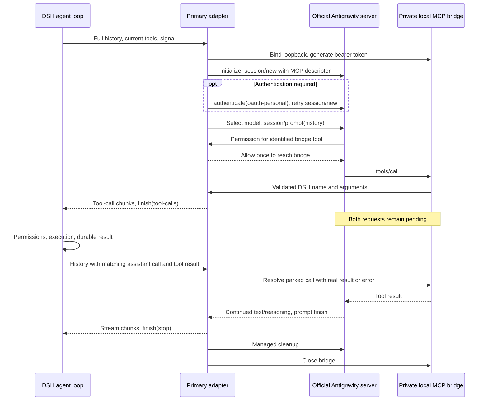

# Architecture and ownership

The Cordis plugin registers a primary LlmAdapter through ctx.llm.registerAdapter.
The bundle mounts it and selects antigravity-acp/server-default for fresh chats.
Saved choices retain DSH's normal precedence. Google's official server owns
model networking, OAuth and credentials. ACP v1 uses the official SDK over
DSH-managed stdio subprocesses.

## A tool turn

The adapter executes no filesystem, command or extension tool itself. DSH receives
ordinary tool-call blocks with the original tool name, validated JSON arguments
and a fresh correlation ID. Its existing permissions, tool wrappers, execution,
hooks and durable result messages stay in control. Denial becomes MCP isError:
true. Parallel calls and sequential rounds share one ACP prompt.

ACP tool_call updates describe remote-agent activity, not DSH execution requests.
Recognized bridge updates are tracked and ignored for tool execution; only actual
MCP requests create DSH calls. This prevents duplicate execution. Permissions
require exact \_meta.mcp.server and an exported tool name, as verified against
Google 1.3.0. Only allow_once is selected; unrecognized requests are cancelled.
No YOLO mode is enabled.

## History and lifecycle

Each independent generation reconstructs its prompt from complete DSH history.
It starts a fresh ACP session, except that the first request without tools can
claim the still-empty discovery session once. This session has no MCP endpoint
and has never received a prompt. Completed ACP sessions are never resumed.
Only an unfinished tool exchange survives between DSH generations. Continuation
checks the history prefix, provider/model/system/tool catalog and exact assistant
call/result IDs. Missing or duplicate results fail explicitly. Changed context
or tools closes the old exchange and starts from authoritative DSH history.
Title and compaction calls cannot borrow a pending tool turn. No plugin credential,
history or session database is created.

Each in-flight tool turn has its own managed ACP process and private MCP endpoint.
After a successful turn, its MCP endpoint is closed and its handlers detached.
Up to two healthy processes can be retained for idleProcessTimeoutMs (five minutes
by default). A new turn checks out one exclusively, opens a fresh ACP session,
selects the requested model and creates a new MCP endpoint from the current DSH
tool schemas. The model-discovery process enters the same ready pool. Pooling
does not preserve plugin conversation histories or resume completed ACP sessions.
Idle expiry, provider disposal, cancellation and errors dispose the affected
processes; maxSessionsPerProcess still bounds each retained process's sessions.
This isolates conversations and allows subagent tools to call the provider while
the parent waits for their result. A bounded active-turn limit fails explicitly
instead of queueing recursive calls indefinitely. Requests without tools remain
serialized and exclusively borrow a healthy idle process when available, otherwise
using their persistent client. Borrowed processes remain owned by the provider
until returned or discarded, so provider disposal also awaits their cleanup.
They cannot borrow a process with a pending tool exchange. An unused discovery
session can be claimed only while its process remains connected; creating another
session, starting its prompt or resetting the process invalidates this claim.
maxSessionsPerProcess still bounds session creation on all retained processes.

timeoutMs bounds each active model segment. It pauses while DSH owns tool
execution; toolTimeoutMs separately bounds waiting for results. Abort listeners
remain active between adapter calls. Cancellation, early return, timeout,
native-tool rejection and disposal close the SDK, send ACP's cancel notification
when applicable and tear down the managed process range. Cleanup settles parked
HTTP calls and removes private scratch directories. Partial responses are not
automatically retried.

## Local bridge boundary

The official MCP SDK supplies stateless Streamable HTTP. The bridge binds only
127.0.0.1, requires a fresh 256-bit bearer token on every request, validates Host,
refuses browser Origins and accepts only POST on /mcp. Bodies are limited to
1 MiB. Catalogs have at most 256 unique tools, each definition at most 128 KiB.
Hashed MCP names prevent normalization collisions. AJV validates the original
JSON schema without dropping constraints or fetching remote references. Invalid
definitions fail explicitly; invalid arguments never reach DSH. A turn accepts
at most 64 simultaneous pending calls. These bounds concern protocol inputs,
not arbitrary resource use by Google's model service.

Client filesystem and terminal capabilities remain false. The official server
gets a private scratch cwd, not the DSH workspace, and only our MCP endpoint.
Prompt instructions restrict it to DSH tools. These are protocol guardrails,
not an OS sandbox: a native server-owned action might occur before notification.
The plugin detects, cancels and reports it; absolute confinement of the official
agent executable is not guaranteed.

## Provisioning, streaming and errors

Automatic installation downloads Google's complete pinned 1.3.0 ZIP over HTTPS
from Registry URLs. ZIP paths/types/sizes are validated; sibling runtime files
and executable permissions are retained. Cache completeness receipts publish
atomically under a lock. Partial/corrupt caches retry. Receipts are not vendor
signatures; the Registry advertises no checksum. No postinstall download or
Google binary redistribution occurs.

ACP text/thought chunks map to stable DSH block indexes. Blocks close before the
single terminal finish. Tool blocks use subsequent indexes. usage_update is
context occupancy, not billable counters, so usage is not invented. Unsupported
sampling controls and unprojected binary inputs fail explicitly. Raw remote
errors and stderr are not logged; errors expose sanitized LlmError codes.
